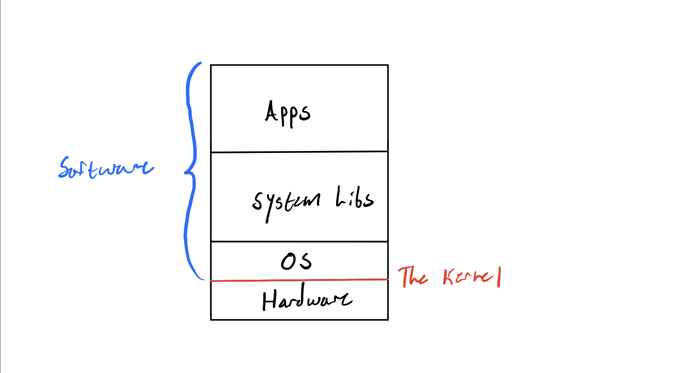

# Introduction

## Background 
To start your journey into binary reversing and exploitation, you first need to understand the platform
on which you reverse and exploit. As you are likely aware, you are currently on an operating system (OS):
likely Windows or MacOS. Generally, people know the difference between these OS, but
to be a good hacker you must understand these differences on a technical level. In future modules,
we will talk about MacOS and Windows, but for now Linux will suffice.

What is Linux you may ask? Linux is the operating system of hackers! It is also the OS
that most embedded devices and servers use. Linux is [open-source](https://opensource.com/resources/what-open-source),
which means it is also an OS that is easy to develop on and learn (relative 
to the other ones). Right now it might not be clear what you would be developing that is related
to the OS or how it is useful, but it will hopefully be more clear at the end 
of this section.

## Linux

To get a better idea of what Linux is, read the first five sections of this 
[article](https://www.linux.com/what-is-linux/). 

...

Now that you know what a distribution of Linux is, you can be informed that we will be using the mainstream, 
Debian based distribution [Ubuntu](https://ubuntu.com/tutorials). If you have found your way here 
through external hacking tutorials, you be tempted to use [Kali Linux](https://www.kali.org/downloads/), a
similarly Debian based distribution. I'll make the argument that it will be easier to use Ubuntu than Kali,
and for the basis of these tutorials, the up-to-date kernel of Ubuntu is better.

TL;DR: We will use Ubuntu, almost none of the tools on Kali are needed for this.

In the next sub-section, we get Ubuntu installed.

## The Kernel

Before going straight into using an operating system, it's nice to mention that there is a component of
your computer that makes everything run―it's called the **kernel**. In a typical introduction to 
operating systems you would likely be introduced to this idea in-depth, but I will only briefly 
talk about it. If you are very interested, you should read [this](https://www.amazon.com/Understanding-Linux-Kernel-Third-Daniel/dp/0596005652) book after completing this handbook,
as the content assumes you are already a systems hacker.

The kernel is the lowest running software that is always running when the computer is on. It's a fundamental
part of the operating system that runs on your computer. If you imagined the computer as a stack of 
software and hardware, the kernel would be the line that divides the two:

The kernel is responsible for:
- making sure programs have somewhere to run (talked about later)
- hardware peripherals, like you physical mouse, actually do things
- your computer having enough memory to function 

And various other tasks that set your computer apart from your toaster oven. It is often true that each 
operating system will have its own kernel that was designed to work with it.

Since this "program" called the kernel is always running and controls everything important, it's safe to 
assume that this program is at a higher level of existence than a normal program. Not only is it at a 
higher level of **privilege** than a normal program, but it is also at a higher level of privilege than
an admin. The kernel is the god of this computing world, none come before it. 

Luckily, this god known as the kernel is benevolen and allows measly normal programs to use parts of
it when needed. Let's take my favorite game [minecraft](https://minecraft.net) as an example.

### Minecraft as an example

When you use a normal program, like Minecraft, you are running the program in **user space**. The
user space is the virtual space of your computer where normal programs run. As expected, there 
exists a space for kernel things called the **kernel space**.  

So you launch Minecraft, and load into your favorite world. You are in the user space. But now,
you move your mouse so that your view in Minecraft rotates -- you have now brefily entered 
kernel space. Why? Because hardware caused something called an `interrupt`, which is the 
god analogy equivalent of praying for got to bless you power for a brief time. 

When you move your mouse this is what happens:
1. The software that drives the mouse detects a movement
2. The software causes an interrupt, which stops whatever else is running for a brief time
3. It enters kernel mode by setting a value that signifies that it is "privileged"
4. The kernel interprets the exact movement then sends the info back to user space 
5. The mouse move is handled in Minecraft. 

You can visualize it like this:

### TL;DR

The gist here is that there is a **super privileged** software running on every computer called
the kernel. The kernel controls everything at the lowest level, and compromising it means you
compromised everything above it―any software running on the computer. In our next section
on virtualization, it's helpful to know this thing called the kernel exists. 
