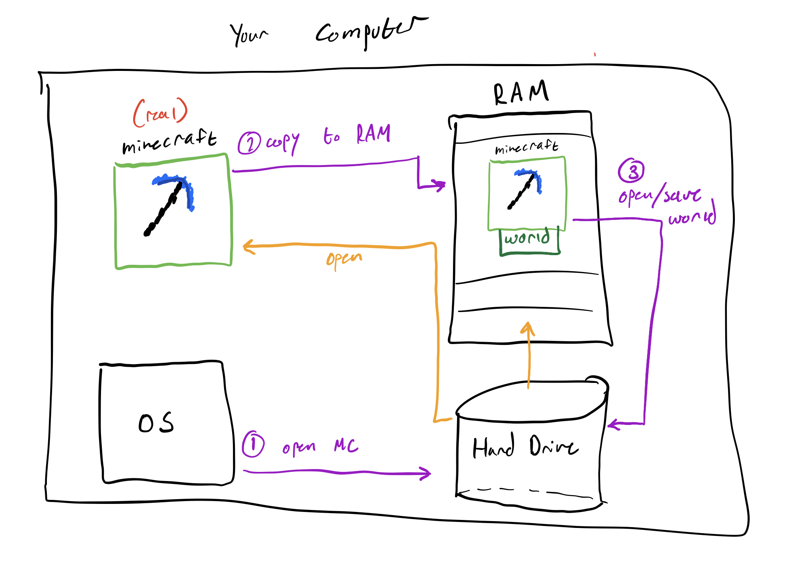

# Programs in Memory

## Things Exist in Memory 

Recall our earlier discussion on the Von Neumann architecture. We want things that we need faster to be used in the RAM since it is faster than the disk. 

The things we usually need faster than anything else are our running **programs**. In addition, we don't need the space taken up by the running program to exist for a *long time*. Once we close our program, we want the running code that runs that program to be destroyed. To clarify, we don't want the data that the program creates destroyed, but the actual code that runs the program for that instance of it running. That's a lot of circular logic. Let's explain it out for our favorite game Minecraft.

### Minecraft as something living in Memory

Let's say you wanted to start up Minecraft, open your favorite world you have been working on for three months, and place a single block from your inventory, then save and quit. Here's what happens:

1. You double click the Minecraft icon
2. Immediately, the OS places a copy of Minecraft's Code into RAM
3. The OS (CPU) starts **executing** the location of memory Minecraft specified to start with

Now Minecraft is running and you can interact with it. When you click buttons in the Minecraft game, it simply transitions to different locations in memory where those button's code exists. Now you open your world:

1. You click "open world" and you select your awesome world. 
2. Immediately, Minecraft finds the world on your *hard drive* where it has been saved for months
3. Minecraft copies all the files that make it a world and places it in RAM

Now you are playing Minecraft in your favorite world! When you place a block down, that block is placed in the "copied" world that is currently in RAM. That's right, all of the changes you make before saving are in RAM; that's why games always tell you "don't turn off while saving..." because your RAM contents are essentially deleted when your system turns off. 

So you place the block and save & quit. Then close Minecraft. 

1. Your computer copies the content of the world in RAM and re-saves it over the world on your hard drive
2. Minecraft deletes the world copied into RAM
3. Minecraft sends a signal to the OS that it is done running
4. The OS gets that signal and destroyed the Minecraft copied into RAM. 

Here is a diagram to summarize everything that happened:




Notice how this whole time we were playing on code that was copied into RAM. The entire time, the real Minecraft was sitting comfortably on your hard drive while a copy of it was doing all the world. As with everything you make changes to on your computer, copies are first placed into memory and then saved back to the hard drive after editing. 

As you can see, we care about the response time of Minecraft so we copy it into memory. As with all things we need fast, they go in memory.

## Observing things taking Memory

Open up the fancy terminal again and install `htop`.

```bash
sudo apt-get install htop
```

`htop` is an upgraded version of `top`. It allows you to see what is running on your computer and how much "things" it is using. One of those things is memory. Run `htop` by typing the command `htop` in the terminal. You should see a big thing pop open, with what looks like a sound bar thing on the top of the screen. One of them is labeled `Mem` for Memory. It is of course your RAM usage. Right now, with nothing but a terminal open, you should be seeing no more than 1 Gig of memory being used. 

For me it looks like this:


Now go to your Ubuntu desktop and open `Firefox`. You should notice maybe half a gig of memory now being taken up. If you open more tabs and websites, then more RAM will be taken. This is memory in use! 

## Summary 

Things exist in memory. When you run a program, it is put in memory. When you edit a file it is put in memory. When you run your Virtual Machine, it is put in memory. 
